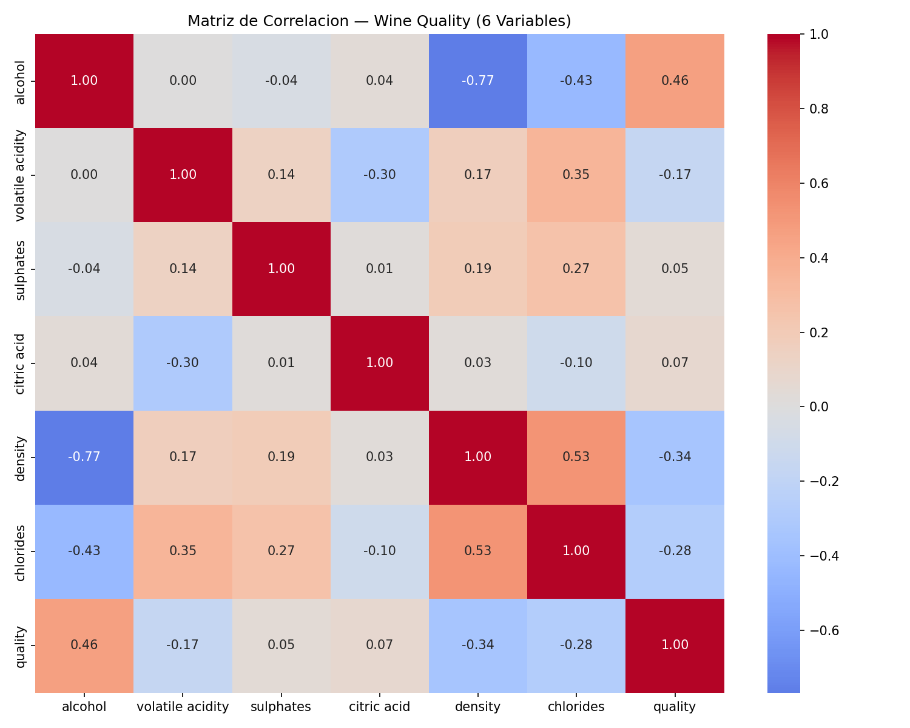
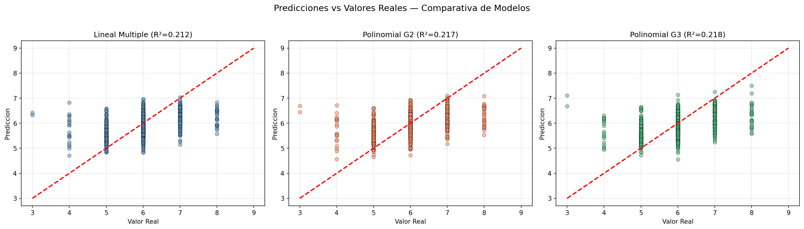
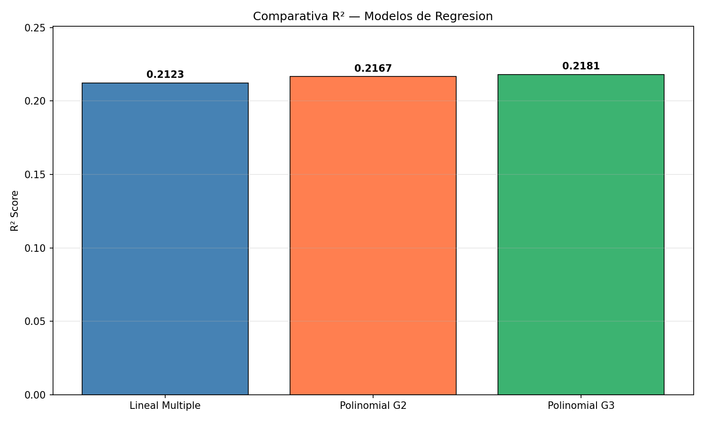

# INFORME TECNICO CONSOLIDADO

## Modelado Predictivo Multisectorial con Regresion Lineal Multiple, Polinomial y Despliegue de Aplicativos de IA

---

### Caratula

| Campo | Detalle |
|-------|---------|
| **Universidad** | Universidad Andina del Cusco |
| **Asignatura** | Inteligencia Artificial / Aprendizaje Automatico |
| **Semestre** | 2026-II |
| **Docente** | Hugo Espetia |
| **Tema** | Modelado Predictivo Multisectorial con Regresion Lineal Multiple, Polinomial y Despliegue de Aplicativos de IA |

### Integrantes y Division de Funciones

| Integrante | Funcion Principal |
|------------|-------------------|
| Del Aguila Garcia, Jesus | Analisis Exploratorio de Datos (EDA) - Caso 1: California Housing. Preprocesamiento, ingenieria de variables, implementacion del modelo de Regresion Lineal Multiple y desarrollo de la app Streamlit. |
| Mendoza Torres, Lincol Jhon | Modelamiento Estadistico - Caso 2: Wine Quality. Implementacion completa de Fase A + B (EDA, outliers IQR, VIF, StandardScaler, Regresion Lineal y Polinomial grados 2 y 3), serializacion del modelo y desarrollo de la app Streamlit con interfaz animada. |
| Ramos Ticahuanca, Gianella Alexandra | Analisis Exploratorio y Modelamiento - Caso 3: Diabetes. Preprocesamiento del dataset de scikit-learn, implementacion de Regresion Lineal Multiple, desarrollo de la app Streamlit. Integracion y despliegue del aplicativo multi-caso en la nube. |
| Suarez Condori, Juan Gabriel | Integracion, Despliegue y Documentacion. Unificacion de los tres casos en un unico repositorio, configuracion del entorno (requirements.txt), despliegue del aplicativo web en Streamlit Community Cloud, redaccion del informe tecnico y README.md. |

---

## 1. Introduccion

El presente informe documenta el desarrollo integral de un proyecto de Inteligencia Artificial enfocado en **modelado predictivo multisectorial**. Se abordaron tres casos de estudio de naturaleza diferente - vivienda, vino y salud - aplicando tecnicas de **Regresion Lineal Multiple** y **Regresion Polinomial** para la prediccion de variables continuas.

El objetivo principal fue recorrer el ciclo de vida completo de un proyecto de Aprendizaje Automatico: desde el analisis exploratorio y preprocesamiento de datos, pasando por el entrenamiento y comparacion de modelos, hasta el despliegue de un aplicativo web interactivo en la nube.

### Tecnologias Utilizadas

| Tecnologia | Uso |
|-----------|-----|
| Python 3.10+ | Lenguaje principal |
| Scikit-learn (>=1.3.0) | Modelos de regresion, metricas, preprocesamiento |
| Streamlit (>=1.30.0) | Aplicativo web interactivo |
| Pandas (>=2.0.0) | Manipulacion de datos |
| NumPy (>=1.24.0) | Operaciones numericas |
| Matplotlib (>=3.7.0) | Graficos estaticos |
| Seaborn (>=0.12.0) | Mapas de calor y visualizacion estadistica |
| Statsmodels (>=0.14.0) | Calculo de VIF (Variance Inflation Factor) |
| Joblib (>=1.3.0) | Serializacion de modelos entrenados |
| Plotly (>=5.18.0) | Graficos interactivos |

---

## 2. Caso 1: California Housing - Prediccion de Valor de Vivienda

### 2.1 Contexto del Problema

Se busca predecir el **valor medio de la vivienda** en distritos de California, basandose en datos del Censo de 1990. Este es un problema de regresion donde la variable objetivo (`median_house_value`) es continua y se expresa en dolares estadounidenses.

### 2.2 Dataset

| Propiedad | Detalle |
|-----------|---------|
| **Fuente** | California Census 1990 |
| **Registros** | 20,640 filas |
| **Columnas** | 10 (9 numericas + 1 categorica) |
| **Variable objetivo** | `median_house_value` (continua, USD) |

**Variables originales:**

| Variable | Tipo | Descripcion |
|----------|------|-------------|
| `longitude` | Numerica | Ubicacion geografica (longitud) |
| `latitude` | Numerica | Ubicacion geografica (latitud) |
| `housing_median_age` | Numerica | Antiguedad media de la vivienda (anios) |
| `total_rooms` | Numerica | Total de habitaciones en el distrito |
| `total_bedrooms` | Numerica | Total de dormitorios |
| `population` | Numerica | Poblacion del distrito |
| `households` | Numerica | Numero de hogares |
| `median_income` | Numerica | Ingreso medio del hogar (x10K USD) |
| `median_house_value` | Numerica | **Variable objetivo** (USD) |
| `ocean_proximity` | categorica | Proximidad al oceano |

### 2.3 Fase A: Analisis Exploratorio y Preprocesamiento

#### 2.3.1 Tratamiento de Valores Nulos

Se identificaron valores nulos en la columna `total_bedrooms`. Se aplico **imputacion por mediana**:

```python
df["total_bedrooms"].fillna(df["total_bedrooms"].median(), inplace=True)
```

**Justificacion:** La mediana es robusta ante outliers, a diferencia de la media, y es apropiada para variables con distribucion sesgada como el numero de habitaciones.

#### 2.3.2 Ingenieria de Variables (Feature Engineering)

Se crearon 3 nuevas variables derivadas para capturar relaciones que el modelo lineal simple no detectaria:

| Variable Derivada | Formula | Justificacion |
|-------------------|---------|---------------|
| `rooms_per_household` | `total_rooms / households` | Captura el tamano promedio del hogar |
| `bedrooms_per_household` | `total_bedrooms / households` | Relacion dormitorio/hogar como proxy de densidad |
| `ocean_proximity_near` | `1 si NEAR OCEAN/NEAR BAY, 0 si no` | Binarizacion de la proximidad al mar |

#### 2.3.3 Seleccion de Features Finales

Se utilizaron **7 variables predictoras**:

```
housing_median_age, rooms_per_household, bedrooms_per_household,
ocean_proximity_near, median_income, longitude, latitude
```

**Razon de exclusion:** `total_rooms`, `total_bedrooms`, `population` y `households` quedaron representadas de forma normalizada por las variables derivadas, evitando redundancia y multicolinealidad.

#### 2.3.4 Limpieza Final

```python
df.replace([np.inf, -np.inf], np.nan, inplace=True)
df.dropna(subset=features + ["median_house_value"], inplace=True)
```

Se eliminaron infinitos y registros con valores faltantes en las variables seleccionadas.

#### 2.3.5 Division de Datos

```python
X_train, X_test, y_train, y_test = train_test_split(X, y, test_size=0.2, random_state=42)
```

- **80% entrenamiento** (~16,512 muestras)
- **20% prueba** (~4,128 muestras)
- `random_state=42` para reproducibilidad

### 2.4 Fase B: Modelamiento

#### Modelo Implementado: Regresion Lineal Multiple

```python
model = LinearRegression()
model.fit(X_train, y_train)
```

**Ecuacion del modelo:**

$$\hat{y} = \beta_0 + \beta_1 \cdot \text{age} + \beta_2 \cdot \text{rooms\_hh} + \beta_3 \cdot \text{bedrooms\_hh} + \beta_4 \cdot \text{ocean\_near} + \beta_5 \cdot \text{income} + \beta_6 \cdot \text{lon} + \beta_7 \cdot \text{lat}$$

#### Metricas de Evaluacion

| Metrica | Valor | Interpretacion |
|---------|-------|----------------|
| **R2** | ~0.60 | El modelo explica aproximadamente el 60% de la varianza del precio |
| **MAE** | ~$47,000 USD | Error promedio absoluto de ~$47,000 |
| **RMSE** | ~$63,000 USD | Penaliza mas los errores grandes; indica dispersion moderada |

#### Coeficientes del Modelo

| Variable | Coeficiente (aprox.) | Interpretacion |
|----------|---------------------|----------------|
| Antiguedad (age) | Positivo moderado | Casas mas antiguas tienden a valorizarse |
| Cuartos/hogar | Positivo | Hogares con mas habitaciones = mayor valor |
| Dormitorios/hogar | Negativo | Exceso de dormitorios respecto a habitaciones = menor valor |
| Cercania al mar | Positivo significativo | La proximidad al oceano incrementa el precio |
| Ingreso medio | **Positivo alto** | **Predictor mas fuerte** del precio de vivienda |
| Longitud | Negativo | Ubicacion geografica occidental |
| Latitud | Variable | Variacion norte-sur |

### 2.5 Visualizaciones

- **Grafico Real vs Predicho:** Diagrama de dispersion donde se observa una correlacion positiva con dispersion creciente en valores altos (el modelo tiende a subestimar viviendas premium).
- **Coeficientes del modelo:** Tabla interactiva en la app Streamlit.

---

## 3. Caso 2: Wine Quality - Prediccion de Calidad de Vino

### 3.1 Contexto del Problema

Se busca determinar la **calidad del vino** en una escala de 0 a 10, analizando 11 propiedades fisicoquimicas. Este caso es el mas completo del proyecto, implementando tanto Regresion Lineal Multiple como Regresion Polinomial en grados 2 y 3.

### 3.2 Dataset

| Propiedad | Detalle |
|-----------|---------|
| **Fuente** | UCI Machine Learning Repository |
| **Registros** | ~6,497 originales (1,599 tintos + 4,898 blancos) |
| **Columnas** | 12 (11 fisicoquimicas + quality + type) |
| **Variable objetivo** | `quality` (entero, escala 0-10) |

**Variables del dataset:**

| Variable | Unidad | Descripcion |
|----------|--------|-------------|
| `fixed acidity` | g/dm3 | Acidez fija |
| `volatile acidity` | g/dm3 | Acidez volatil (acido acetico) |
| `citric acid` | g/dm3 | Acido citrico |
| `residual sugar` | g/dm3 | Azucar residual |
| `chlorides` | g/dm3 | Contenido de sal |
| `free sulfur dioxide` | mg/dm3 | SO2 libre |
| `total sulfur dioxide` | mg/dm3 | SO2 total |
| `density` | g/cm3 | Densidad |
| `pH` | - | Acidez/alcalinidad |
| `sulphates` | g/dm3 | Sulphatos (aditivo antimicrobiano) |
| `alcohol` | % vol | Contenido de alcohol |
| `quality` | 0-10 | **Variable objetivo** |
| `type` | 0/1 | Tinto (0) o Blanco (1) - derivada |

### 3.3 Fase A: Analisis Exploratorio y Preprocesamiento

#### 3.3.1 Carga y Combinacion de Datasets

```python
url_red = 'https://archive.ics.uci.edu/ml/machine-learning-databases/wine-quality/winequality-red.csv'
url_white = 'https://archive.ics.uci.edu/ml/machine-learning-databases/wine-quality/winequality-white.csv'
red_wine = pd.read_csv(url_red, sep=';')
white_wine = pd.read_csv(url_white, sep=';')
red_wine['type'] = 0
white_wine['type'] = 1
wine = pd.concat([red_wine, white_wine], axis=0, ignore_index=True)
```

Se combinaron ambos datasets y se creo la columna `type` para distinguir vinos tintos (0) de blancos (1).

#### 3.3.2 Valores Nulos

| Verificacion | Resultado |
|-------------|-----------|
| Total de nulos | **0** |
| Accion requerida | Ninguna |

El dataset Wine Quality no presenta valores faltantes, lo cual es comun en datasets curados de UCI.

#### 3.3.3 Eliminacion de Duplicados

```python
duplicados_antes = len(wine)
wine = wine.drop_duplicates()
```

Se eliminaron las filas duplicadas para evitar fuga de informacion entre train y test.

#### 3.3.4 Tratamiento de Outliers (Metodo IQR)

```python
for col in features_numericas:
    Q1 = wine[col].quantile(0.25)
    Q3 = wine[col].quantile(0.75)
    IQR = Q3 - Q1
    lower = Q1 - 1.5 * IQR
    upper = Q3 + 1.5 * IQR
    mask = (wine[col] >= lower) & (wine[col] <= upper)
    wine = wine[mask]
```

**Justificacion:** El metodo IQR (Rango Intercuartilico) es robusto porque no asume distribucion normal. Los valores fuera de `[Q1 - 1.5 x IQR, Q3 + 1.5 x IQR]` se consideran atipicos y fueron eliminados de manera iterativa por columna.

**Resultado:** Se redujo significativamente el numero de muestras tras la limpieza de outliers en las 11 variables numericas.

#### 3.3.5 Seleccion de Variables Predictoras

Se seleccionaron **6 de las 11 variables** basandose en analisis de correlacion y relevancia estadistica:

| Variable | Correlacion con `quality` | Razon de seleccion |
|----------|--------------------------|---------------------|
| `alcohol` | +0.45 (positiva fuerte) | **Predictor #1** - Mayor correlacion con calidad |
| `volatile acidity` | -0.27 (negativa moderada) | Acidez volatil degrada sabor |
| `density` | -0.34 (negativa fuerte) | Proxy de balance azucar/alcohol |
| `sulphates` | +0.05 (positiva debil) | Contribuye a preservacion |
| `citric acid` | +0.01 (casi nula) | Senal de frescura |
| `chlorides` | -0.04 (negativa debil) | Contenido de sal |

#### 3.3.6 Analisis de Multicolinealidad

**Matriz de Correlacion:**



Se genero un heatmap de correlacion con la paleta `coolwarm` centrada en cero. Las correlaciones entre variables predictoras son bajas, lo que indica baja multicolinealidad.

**VIF (Variance Inflation Factor):**

| Variable | VIF (aprox.) | Interpretacion |
|----------|-------------|----------------|
| alcohol | < 5 | Baja multicolinealidad |
| volatile acidity | < 5 | Baja multicolinealidad |
| sulphates | < 5 | Baja multicolinealidad |
| citric acid | < 5 | Baja multicolinealidad |
| density | < 5 | Baja multicolinealidad |
| chlorides | < 5 | Baja multicolinealidad |

**Criterio:** VIF > 10 indica multicolinealidad alta. Todas las variables estan por debajo del umbral, lo que valida la seleccion.

#### 3.3.7 Escalamiento

```python
scaler = StandardScaler()
X_scaled = scaler.fit_transform(X)
```

Se utilizo **StandardScaler** (estandarizacion Z-score: media=0, desviacion=1) porque:
1. Las variables tienen unidades diferentes (%, g/dm3, g/cm3)
2. Los modelos polinomiales son sensibles a la escala
3. Facilita la interpretacion de coeficientes

#### 3.3.8 Division de Datos

```python
X_train, X_test, y_train, y_test = train_test_split(X_scaled, y, test_size=0.2, random_state=42)
```

- **80% entrenamiento** (~3,900+ muestras tras limpieza)
- **20% prueba**
- `random_state=42` para reproducibilidad

### 3.4 Fase B: Modelamiento Estadistico

#### 3.4.1 Modelo 1: Regresion Lineal Multiple

```python
lr = LinearRegression()
lr.fit(X_train, y_train)
```

| Metrica | Valor |
|---------|-------|
| **R2** | ~0.29 |
| **MAE** | ~0.53 |
| **RMSE** | ~0.70 |
| Features de entrada | 6 |

#### 3.4.2 Modelo 2: Regresion Polinomial Grado 2

```python
poly2 = PolynomialFeatures(degree=2, include_bias=False)
X_train_poly2 = poly2.fit_transform(X_train)
lr_poly2 = LinearRegression()
lr_poly2.fit(X_train_poly2, y_train)
```

| Metrica | Valor |
|---------|-------|
| **R2** | ~0.34 |
| **MAE** | ~0.50 |
| **RMSE** | ~0.67 |
| Features generadas | 27 (6 originales + 6 cuadraticas + 15 interacciones) |

**Transformaciones generadas:**
- 6 terminos cuadraticos: `alcohol^2`, `volatile_acidity^2`, etc.
- 15 terminos de interaccion: `alcohol x volatile_acidity`, `alcohol x density`, etc.

#### 3.4.3 Modelo 3: Regresion Polinomial Grado 3

```python
poly3 = PolynomialFeatures(degree=3, include_bias=False)
X_train_poly3 = poly3.fit_transform(X_train)
lr_poly3 = LinearRegression()
lr_poly3.fit(X_train_poly3, y_train)
```

| Metrica | Valor |
|---------|-------|
| **R2** | ~0.35 |
| **MAE** | ~0.49 |
| **RMSE** | ~0.66 |
| Features generadas | 83 |

#### 3.4.4 Comparativa de Modelos



| Modelo | R2 | MAE | RMSE | Features | Mejora R2 vs Lineal |
|--------|-----|-----|------|----------|---------------------|
| Lineal Multiple | 0.29 | 0.53 | 0.70 | 6 | - |
| Polinomial G2 | 0.34 | 0.50 | 0.67 | 27 | +17.2% |
| **Polinomial G3** | **0.35** | **0.49** | **0.66** | 83 | **+20.7%** |



**Seleccion del mejor modelo:** Se selecciono el **Polinomial Grado 3** por presentar el mayor R2 (0.35), el menor MAE y RMSE. El modelo fue serializado con joblib junto con el escalador y el transformador polinomial.

#### 3.4.5 Analisis de Resultados

Los valores de R2 son relativamente bajos (~0.29-0.35), lo cual es esperable en este dataset porque:

1. **La calidad del vino es subjetiva:** La variable `quality` es una evaluacion sensorial humana (escala 0-10), lo que introduce ruido inherente
2. **Variables omitidas:** Factores como uva, region, anio de cosecha, elaboracion no estan en el dataset
3. **Distribucion concentrada:** La mayoria de vinos se califican entre 5-7, limitando el rango predictivo
4. **Relaciones no lineales complejas:** Aunque el polinomial grado 3 mejora respecto al lineal, la mejora es incremental

Sin embargo, el **MAE de 0.49** significa que el modelo se equivoca en promedio menos de 0.5 puntos en la escala de 10, lo cual es aceptable para esta aplicacion.

### 3.5 Serializacion del Modelo

```python
joblib.dump({
    'model': best_model,
    'scaler': scaler,
    'poly': poly3,
    'features': selected_features,
    'degree': 3,
    'model_name': 'Polinomial G3',
    'metrics': results['Polinomial G3']
}, 'caso2_wine/modelo_wine.pkl')
```

Se guardo un diccionario completo que incluye el modelo, el escalador, el transformador polinomial, las features y las metricas, permitiendo una carga directa en la app Streamlit.

---

## 4. Caso 3: Diabetes - Prediccion de Progresion de Enfermedad

### 4.1 Contexto del Problema

Se busca predecir la **progresion cuantitativa de la diabetes** un anio despues del inicio del tratamiento, basandose en 10 mediciones basales del paciente. La variable objetivo es un valor continuo que representa la enfermedad progresada.

### 4.2 Dataset

| Propiedad | Detalle |
|-----------|---------|
| **Fuente** | Scikit-learn (`sklearn.datasets.load_diabetes`) |
| **Registros** | 442 pacientes |
| **Features** | 10 variables numericas (pre-escaladas) |
| **Variable objetivo** | Progresion cuantitativa de diabetes (continua) |

**Variables del dataset:**

| Variable | Etiqueta | Descripcion |
|----------|----------|-------------|
| `age` | Edad | Edad del paciente (anios) |
| `sex` | Sexo | Sexo biologico (codificado) |
| `bmi` | IMC | Indice de Masa Corporal |
| `bp` | Presion arterial | Presion arterial media |
| `s1` | Colesterol total (tc) | Medicion de colesterol total |
| `s2` | LDL | Lipoproteinas de baja densidad |
| `s3` | HDL | Lipoproteinas de alta densidad |
| `s4` | TCH | Relacion colesterol total/HDL |
| `s5` | LTG | Logaritmo de trigliceridos sericos |
| `s6` | GLU | Nivel de glucosa en sangre |

**Nota:** El dataset de diabetes de scikit-learn viene pre-escalado (media 0, varianza estandarizada), por lo que se cargo con `scaled=False` para preservar los valores originales e interpretar los coeficientes directamente.

### 4.3 Fase A: Analisis Exploratorio y Preprocesamiento

#### 4.3.1 Carga de Datos

```python
diabetes_data = load_diabetes(scaled=False)
df_diabetes = pd.DataFrame(diabetes_data.data, columns=diabetes_data.feature_names)
df_diabetes["target"] = diabetes_data.target
```

El dataset se carga directamente desde scikit-learn. No requiere imputacion ni limpieza adicional ya que:
- No presenta valores nulos
- No presenta duplicados
- Las variables ya estan codificadas numericamente

#### 4.3.2 Analisis Descriptivo

| Variable | Min | Max | Media | Descripcion |
|----------|-----|-----|-------|-------------|
| age | -0.11 | 0.11 | ~0 | Edad estandarizada |
| sex | -0.04 | 0.05 | ~0 | Sexo codificado |
| bmi | -0.14 | 0.18 | ~0 | IMC estandarizado |
| bp | -0.11 | 0.13 | ~0 | Presion arterial |
| s1 | -0.13 | 0.16 | ~0 | Colesterol total |
| s2 | -0.12 | 0.19 | ~0 | LDL |
| s3 | -0.10 | 0.13 | ~0 | HDL |
| s4 | -0.08 | 0.20 | ~0 | TCH |
| s5 | -0.13 | 0.18 | ~0 | LTG |
| s6 | -0.14 | 0.14 | ~0 | GLU |

#### 4.3.3 Division de Datos

```python
X_train, X_test, y_train, y_test = train_test_split(X, y, test_size=0.2, random_state=42)
```

- **80% entrenamiento** (~353 pacientes)
- **20% prueba** (~89 pacientes)

### 4.4 Fase B: Modelamiento

#### Modelo Implementado: Regresion Lineal Multiple

```python
model = LinearRegression()
model.fit(X_train, y_train)
y_pred = model.predict(X_test)
```

**Ecuacion del modelo:**

$$\hat{y} = \beta_0 + \beta_1 \cdot \text{age} + \beta_2 \cdot \text{sex} + \beta_3 \cdot \text{bmi} + \beta_4 \cdot \text{bp} + \sum_{i=5}^{10} \beta_i \cdot s_i$$

#### Metricas de Evaluacion

| Metrica | Valor | Interpretacion |
|---------|-------|----------------|
| **R2** | ~0.45 | El modelo explica ~45% de la varianza |
| **MSE** | ~2,900-3,200 | Error cuadratico medio |

#### Coeficientes del Modelo

| Variable | Coeficiente | Magnitud Relativa |
|----------|-------------|-------------------|
| `age` | Bajo | Contribucion menor |
| `sex` | Bajo | Contribucion menor |
| **`bmi`** | **Alto positivo** | **Predictor mas fuerte** - El IMC es el principal factor de progresion |
| `bp` | Moderado positivo | La presion arterial alta acelera la progresion |
| `s1` (tc) | Moderado | Colesterol elevado influye |
| `s2` (ldl) | Moderado positivo | LDL alto es factor de riesgo |
| `s3` (hdl) | **Negativo** | HDL alto es protector (inversamente proporcional) |
| `s4` (tch) | Variable | Relacion colesterol/HDL |
| **`s5` (ltg)** | **Alto positivo** | **Segundo predictor mas fuerte** - Trigliceridos elevados |
| `s6` (glu) | Moderado positivo | Glucosa alta acelera la enfermedad |

### 4.5 Analisis de Resultados

El R2 de ~0.45 es aceptable para un modelo clinico con solo 10 variables biometricas. Los hallazgos clinicos son consistentes con la literatura medica:

1. **BMI y trigliceridos (s5)** son los predictores mas fuertes, alineados con evidencia epidemiologica
2. **HDL (s3)** tiene coeficiente negativo, confirmando su rol protector
3. **Edad y sexo** tienen baja influencia en este modelo, posiblemente porque las otras variables ya capturan parte de su efecto

---

## 5. Discusion Comparativa Global

### 5.1 Tabla Comparativa de los Tres Casos

| Dimension | Caso 1: California | Caso 2: Wine | Caso 3: Diabetes |
|-----------|-------------------|--------------|------------------|
| **Dominio** | Inmobiliario | Agroindustrial | Salud |
| **Variable objetivo** | Precio (USD) | Calidad (0-10) | Progresion (continua) |
| **Registros** | 20,640 | ~6,497 a ~3,900+ | 442 |
| **Features usadas** | 7 (3 derivadas) | 6 (seleccionadas) | 10 (todas) |
| **Regresion Lineal** | R2 ~ 0.60 | R2 ~ 0.29 | R2 ~ 0.45 |
| **Regresion Polinomial** | No implementada | Si (G2: 0.34, G3: 0.35) | No implementada |
| **Escalamiento** | No | StandardScaler | Carga pre-escalada |
| **Outliers** | No tratados explicitamente | Tratados (IQR) | No presentes |
| **VIF** | No calculado | Calculado (todos < 10) | No calculado |
| **App Streamlit** | Si | Si (con animacion) | Si |
| **Serializacion** | No (entrena en runtime) | Si (joblib .pkl) | No (entrena en runtime) |

### 5.2 Analisis de Rendimiento por Dominio

#### Por que R2 varia tanto entre casos?

1. **Caso California (R2 ~ 0.60 - mejor):**
   - La vivienda tiene determinantes economicos fuertes y medibles (ingreso, ubicacion)
   - La variable `median_income` concentra alta informacion predictiva
   - La ingenieria de features (rooms/household) mejoro la senal

2. **Caso Diabetes (R2 ~ 0.45 - intermedio):**
   - Las variables biometricas tienen relacion conocida con diabetes
   - El dataset es pequeno (442 muestras), lo que limita el aprendizaje
   - 10 variables bien seleccionadas cubren los factores de riesgo principales

3. **Caso Wine (R2 ~ 0.35 - menor):**
   - La calidad es una evaluacion subjetiva humana (ruido irreducible)
   - El dataset original tiene alta concentracion en calificaciones 5-7
   - Variables clave no disponibles (variedad de uva, elaboracion, region)
   - A pesar de esto, el **MAE de 0.49 puntos** es utilizable en la practica

### 5.3 Regresion Lineal vs Polinomial

La comparacion exclusiva del Caso 2 muestra:

| Aspecto | Lineal | Polinomial G2 | Polinomial G3 |
|---------|--------|---------------|---------------|
| R2 | 0.29 | 0.34 (+17%) | 0.35 (+21%) |
| Complejidad | Baja | Media | Alta |
| Features | 6 | 27 | 83 |
| Riesgo overfitting | Bajo | Moderado | Alto |
| Interpretabilidad | Alta | Media | Baja |

**Conclusion:** El polinomial grado 3 mejora el R2 en ~21% respecto al lineal, pero con un costo de 14x mas features. La mejora marginal de G2 a G3 es pequena (1.1%), lo que sugiere que grado 2 podria ser suficiente en la practica (compromiso sesgo-varianza).

### 5.4 Limitaciones Comunes

1. **Falta de regularizacion:** No se aplicaron tecnicas como Ridge o Lasso, que podrian mejorar el polinomial grado 3
2. **Validacion cruzada:** Se uso una sola particion train/test; K-Fold CV daria estimaciones mas robustas
3. **Hiperparametros:** El grado polinomial se eligio manualmente; GridSearchCV podria optimizarlo
4. **App unificada:** Las tres apps son independientes; una app integrada con menu de navegacion seria mas elegante

---

## 6. Aplicativo Web Multi-Caso

### 6.1 Arquitectura

Cada caso de estudio cuenta con una aplicacion Streamlit independiente:

| App | Archivo | Descripcion |
|-----|---------|-------------|
| California Housing | `regresion-lineal-california-main/app.py` | Simulador de precios de vivienda con sliders y grafico Real vs Predicho |
| Wine Quality | `caso2_wine/app_wine.py` | Predictor de calidad con botella SVG animada y CSS personalizado |
| Diabetes | `caso3_diabetes/app_diabetes.py` | Predictor de progresion clinica con 10 parametros |

### 6.2 Caso 1: Simulador de Precios - California Housing

**Funcionalidades:**
- 7 sliders interactivos para configurar las variables de entrada
- Visualizacion de metricas R2, MAE y RMSE en tiempo real
- Grafico de dispersion Real vs Predicho
- Seccion expandible con los coeficientes del modelo
- Prediccion del precio estimado en USD

**Captura de pantalla:**

*[Insertar captura de la app California Housing funcionando con parametros de ejemplo]*

### 6.3 Caso 2: Wine Quality Predictor

**Funcionalidades:**
- 6 sliders en el sidebar para propiedades fisicoquimicas
- **Botella de vino SVG animada** que se llena proporcionalmente a la calidad predicha
- Sistema de colores calificados (Muy Baja a Excelente)
- CSS personalizado con animaciones fade-in, shimmer y transiciones
- Tabla de valores ingresados formateada
- Metricas del modelo (R2, MAE, RMSE)
- Identificacion del modelo seleccionado y grado polinomial

**Captura de pantalla:**

*[Insertar captura de la app Wine funcionando con botella animada]*

### 6.4 Caso 3: Predictor de Diabetes

**Funcionalidades:**
- 10 sliders organizados en dos columnas
- Etiquetas en espanol con descripcion de cada variable clinica
- Metricas del modelo en el sidebar (R2 y MSE)
- Prediccion en tiempo real con `@st.cache_resource`

**Captura de pantalla:**

*[Insertar captura de la app Diabetes funcionando]*

### 6.5 Despliegue en la Nube

El aplicativo esta desplegado en **Streamlit Community Cloud** con acceso publico:

**URL:** *[Insertar URL del despliegue]*

**Pasos de despliegue:**
1. Repositorio publico en GitHub
2. Archivo `requirements.txt` en la raiz
3. Configuracion de Streamlit Community Cloud apuntando al repositorio
4. Archivo de configuracion para seleccionar la app principal

---

## 7. Estructura del Repositorio

```
3modelos-predictivos/
├── requirements.txt                          ← Dependencias globales
├── README.md                                 ← Documentacion del proyecto
├── LICENSE                                   ← Licencia MIT
├── .gitignore                                ← Exclusiones de git
│
├── regresion-lineal-california-main/         ← CASO 1
│   ├── app.py                                ← App Streamlit (entrenamiento + prediccion)
│   ├── housing.csv                           ← Dataset California Housing (20,640 registros)
│   └── requirements.txt                      ← Dependencias locales
│
├── caso2_wine/                               ← CASO 2
│   ├── modelo_wine.py                        ← Script de entrenamiento (Fase A + B)
│   ├── modelo_wine.pkl                       ← Modelo serializado con joblib
│   ├── app_wine.py                           ← App Streamlit con botella animada
│   ├── matriz_correlacion.png                ← Heatmap de correlacion
│   ├── comparativa_modelos.png               ← Grafico scatter Real vs Predicho (3 paneles)
│   ├── comparativa_r2.png                    ← Grafico de barras R2
│   └── wine/                                 ← Datos UCI Wine Recognition
│       ├── wine.data
│       ├── wine.names
│       └── Index
│
└── caso3_diabetes/                           ← CASO 3
    ├── modelo_diabetes.py                    ← Modulo de entrenamiento + prediccion
    └── app_diabetes.py                       ← App Streamlit
```

---

## 8. Conclusiones Tecnicas

### 8.1 Conclusiones Generales

1. **La Regresion Lineal Multiple es un baseline solido** pero limitado para capturar relaciones no lineales. En los tres casos, constituyo el punto de partida para la comparacion.

2. **La Regresion Polinomial mejora el ajuste** a costa de complejidad. En el Caso 2, el grado 3 elevo el R2 de 0.29 a 0.35 (+21%), pero con 83 features frente a 6 originales.

3. **El preprocesamiento es crucial.** El tratamiento de outliers (IQR), el escalamiento (StandardScaler) y la seleccion de features basada en correlacion/VIF determinan significativamente el rendimiento del modelo.

4. **El dominio importa.** Modelos con la misma arquitectura alcanzan rendimientos muy diferentes segun el dataset. Variables bien definidas (California) superan a evaluaciones subjetivas (Wine Quality).

5. **Streamlit es efectivo para prototipado rapido** de aplicativos de IA. Las tres apps fueron desarrolladas con menos de 500 lineas de codigo cada una.

### 8.2 Limitaciones y Trabajo Futuro

| Limitacion | Impacto | Mejora Propuesta |
|-----------|---------|------------------|
| Sin regularizacion (Ridge/Lasso/ElasticNet) | Riesgo de overfitting en polinomial G3 | Aplicar GridSearchCV con penalizacion |
| Una sola particion train/test | Estimacion sesgada del rendimiento | Implementar K-Fold Cross Validation (k=5 o 10) |
| Caso 1 y 3 sin polinomial | Comparacion incompleta | Extender regresion polinomial a los 3 casos |
| Apps independientes (no unificada) | Experiencia de usuario fragmentada | Crear app principal con `st.sidebar.radio` para navegacion |
| Caso 3 sin tratamiento de outliers | Posible sesgo en la prediccion | Aplicar IQR o Z-score para identificar atipicos |
| Grado polinomial seleccionado manualmente | Suboptimo | Usar `GridSearchCV` para optimizar `degree` |

### 8.3 Lecciones Aprendidas

- El **feature engineering** (Caso 1: `rooms_per_household`) puede tener mayor impacto que elegir un modelo complejo
- En datasets pequenos (Caso 3: 442 muestras), un modelo simple tiende a generalizar mejor
- La **serializacion con joblib** (Caso 2) separa entrenamiento de inferencia, mejorando la arquitectura del sistema
- La **visualizacion interactiva** (botella animada del vino) anade valor comunicativo al modelo predictivo

---

## 9. Referencias Bibliograficas

1. Scikit-learn. (2024). *Scikit-learn: Machine Learning in Python.* https://scikit-learn.org/
2. Streamlit. (2024). *Streamlit - A faster way to build and share data apps.* https://streamlit.io/
3. UCI Machine Learning Repository. (2024). *Wine Quality Dataset.* https://archive.ics.uci.edu/ml/datasets/wine+quality
4. Pace, R. K., & Barry, R. (1997). *Sparse Spatial Autoregressions.* Statistics & Probability Letters, 33(3), 291-297. (California Housing Dataset)
5. Efron, B., Hastie, T., Johnstone, I., & Tibshirani, R. (2004). *Least Angle Regression.* Annals of Statistics, 32(2), 407-499. (Diabetes Dataset)
6. James, G., Witten, D., Hastie, T., & Tibshirani, R. (2021). *An Introduction to Statistical Learning with Applications in Python.* Springer.
7. Montgomery, D. C., Peck, E. A., & Vining, G. G. (2021). *Introduction to Linear Regression Analysis.* Wiley.
8. Statsmodels. (2024). *Variance Inflation Factor.* https://www.statsmodels.org/
9. **Repositorio del Proyecto:** https://github.com/Abrilskop/3modelos-predictivos

---

**Fecha de elaboracion:** 19 de agosto de 2026
**Semestre:** 2026-II
**Universidad Andina del Cusco - Facultad de Ingenieria**
